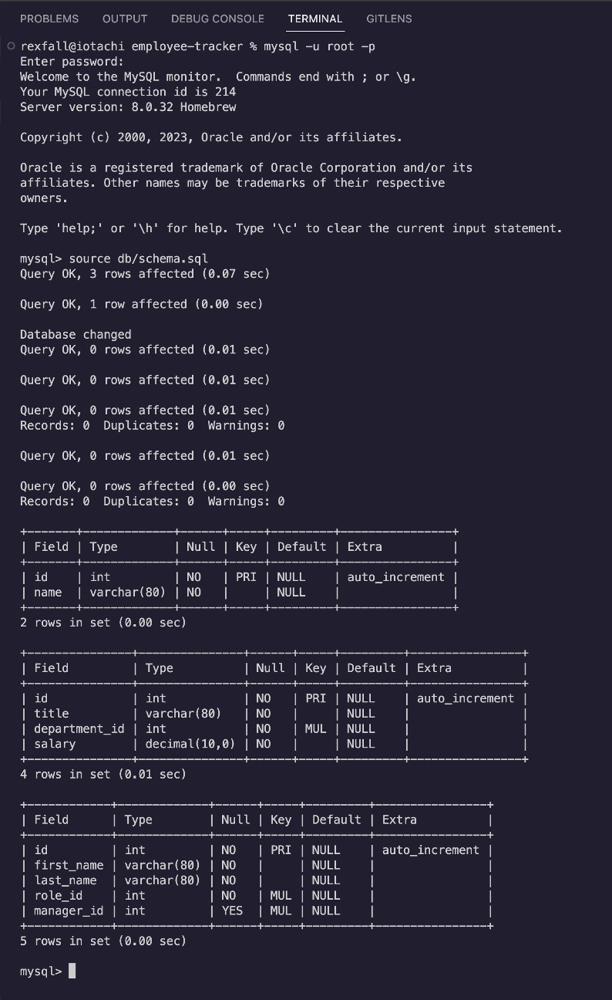
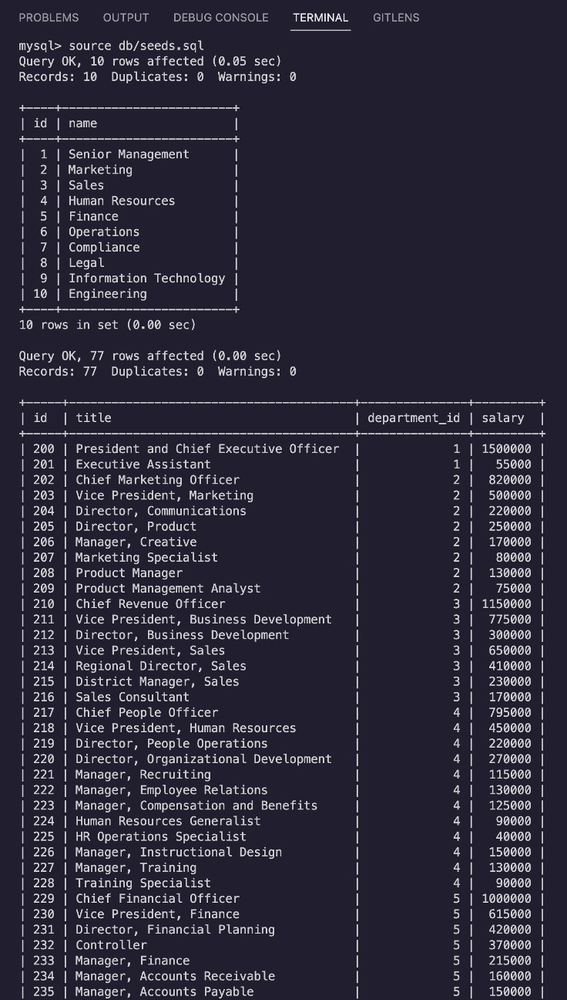
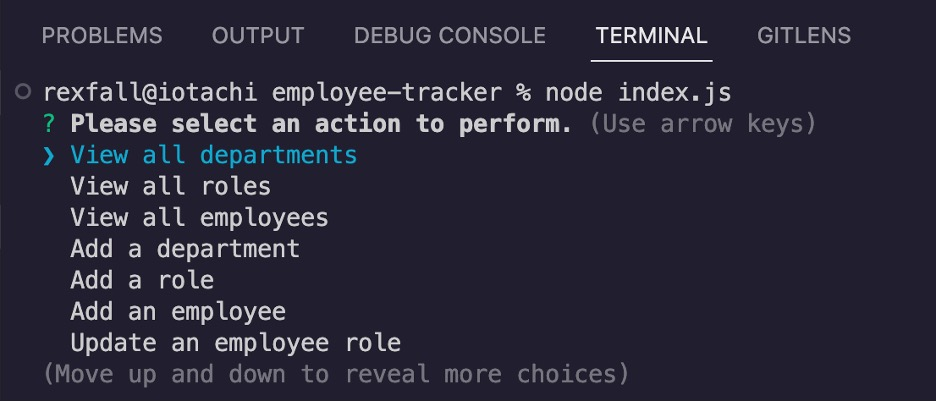
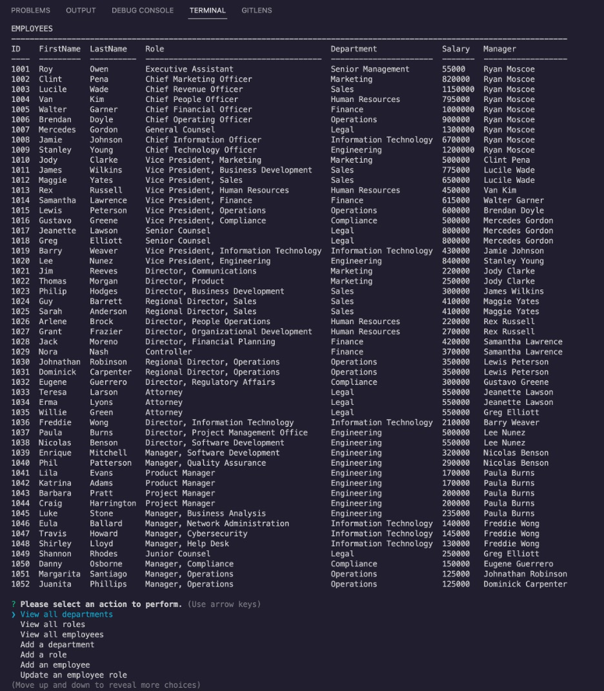
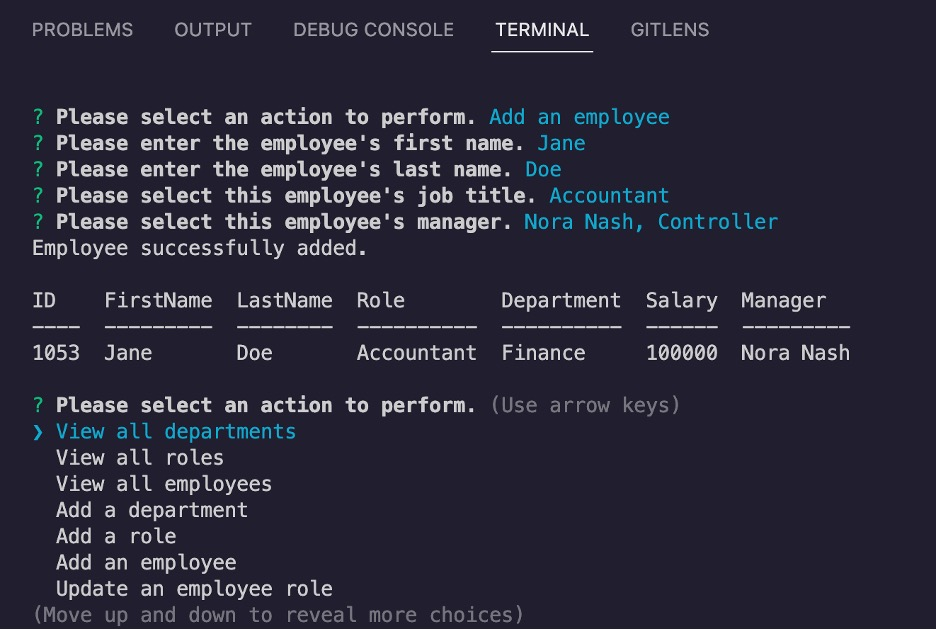

# Employee Tracker

## Technology Used 

| Technology Used         | Resource URL           | 
| ------------- |:-------------:| 
| JavaScript    | [https://developer.mozilla.org/en-US/docs/Web/JavaScript](https://developer.mozilla.org/en-US/docs/Web/JavaScript) | 
| Node.js     | [https://nodejs.org/en/](https://nodejs.org/en/)      |   
| MySQL | [https://www.mysql.com/](https://www.mysql.com/)     |    
| Inquirer | [https://www.npmjs.com/package/inquirer](https://www.npmjs.com/package/inquirer) |
| mysql2 | [https://www.npmjs.com/package/mysql2](https://www.npmjs.com/package/mysql2) |
| console.table | [https://www.npmjs.com/package/console.table](https://www.npmjs.com/package/console.table) |

<br/>

## Description 


This project provides a command line application to interact with a MySQL database, representing a small sliver of an HRIS. The main menu allows the user to select a desired action, which can include viewing a table with departments, roles, or employees; adding a department, role, or employee; updating an existing employee's role; or exiting the system. When adding or updating information, the application prompts the user for the necessary details, updates the database, and returns a confirmation. 

<br/>

## Table of Contents

* [Installation and Usage](#installation-and-usage)
* [Learning Points](#learning-points)
* [Author Info](#author-info)
* [Credits](#credits)
* [License](#license)

<br/>

## Installation and Usage 

### Installation

#### 1. Download the Files

1. Open the **Code** menu on the Code page of this repository and select *Download ZIP*. 
2. Save the ZIP file in the desired directory on your computer and unzip it.

#### 2. Create the Database

1. In your terminal, log into MySQL shell in the root directory for this application. 
2. Run the command ```source db/schema.sql``` to create a local instance of the database (see below).



3. Run the command ```source db/seeds.sql``` to populate the database with seed data.



4. Exit the MySQL shell. 

<br/>

### Usage

In your terminal, run the command ```node index.js``` to launch the application. Using the arrow keys, select a desired action from the Main Menu (see below).



If you select "View all departments," "View all roles," or "View all employees," the application will show a table containing all relevant records in the database. The example below shows the results of selecting "View all employees."



If you select "Add a department," "Add a role," "Add an employee," or "Update an employee role," you will be prompted for the necessary details. The application will then update the database and return a confirmation message, along with the newly added or modified record from the database. The example below shows the process of adding an employee.



After performing any action, the Main Menu appears again. When you are finished using the application, select "Exit" from the main menu.

<br/>

## Learning Points 

I learned a number of tools and skills by completing this project:
* MySQL
* mysql2
* MySQL shell
* MySql Workbench
* console.table
* promise chaining in JavaScript

<br/>

## Author Info

### Ryan Moscoe 

* [Portfolio](https://rmoscoe.github.io/portfolio/)
* [LinkedIn](https://www.linkedin.com/in/ryan-moscoe-8652973/)
* [Github](https://github.com/rmoscoe)

<br/>

## License

See repository for license information.